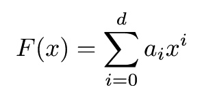

# Polynomial Expansion

- [Polynomial Expansion](#polynomial-expansion)
  - [Introduction](#introduction)
  - [Problem Statement](#problem-statement)
  - [Results](#results)

## Introduction

The following repository houses a simple implementation of polynomial expansion on the CPU and the GPU, and compares them.

You can ignore most file other than `polynomial.cpp` and the `Makefile,` the other's are just scripts to run the function on the compute server at UNCC and the results of those scripts.

## Problem Statement

The problem is simple. It is to compute a polynomial function `F` of degree `d`:

for an array of `n` values of `x`.

## Results

On the CPU (dual Intel Xeon E5-2667 v3) -

| `array size` | `degree` | `time` |
| ---------- | ---- | ---- |
| 1000000000 | 1     | 0.198467 |
| 1000000000 |  10    | 0.595688 |
| 1000000000 |    100  | 7.10604 |
| 1000000000 |   1000   | 87.5317 |

On the GPU (NVidia Tesla K80) -

| `array size` | `degree` | `time` |
| ---------- | ---- | ---- |
| 1000000000 | 1     | 0.401391 |
| 1000000000 |  10    | 0.741949 |
| 1000000000 |    100  | 1.55939 |
| 1000000000 |   1000   | 7.71173 |
